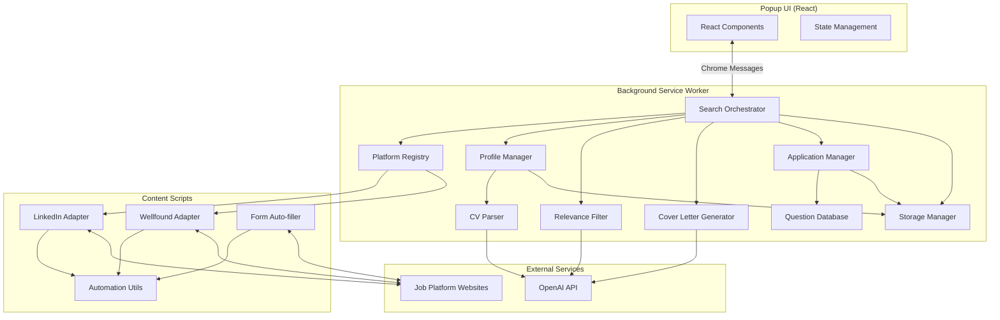

# Design Document

## Overview

The Spooky Job Hunter is a Chrome Manifest V3 extension that automates the entire job search and application process across multiple platforms using a modular, extensible architecture. The system consists of four main layers:

1. **Presentation Layer**: React-based popup UI with Halloween theming
2. **Business Logic Layer**: Platform adapters, search orchestration, profile management, AI integration, and application automation
3. **Data Layer**: Application tracking, question memory, and user profile storage
4. **Infrastructure Layer**: Chrome extension APIs, content scripts, storage, and messaging

The extension uses content scripts to interact with job platform websites, extracting job listings through DOM manipulation, auto-filling application forms, and managing the entire application workflow. AI integration provides CV parsing, job relevance filtering, cover letter generation, and intelligent question matching.

## Architecture

### High-Level Architecture



### Extension Structure

```
spooky-job-hunter/
├── manifest.json                 # Manifest V3 configuration
├── src/
│   ├── popup/                    # React UI
│   │   ├── App.tsx
│   │   ├── components/
│   │   │   ├── JobSearch.tsx
│   │   │   ├── JobResults.tsx
│   │   │   ├── ProfileManager.tsx
│   │   │   ├── CVUpload.tsx
│   │   │   ├── JobCriteriaInput.tsx
│   │   │   ├── ApplicationPreview.tsx
│   │   │   ├── ApplicationHistory.tsx
│   │   │   ├── QuestionLibrary.tsx
│   │   │   ├── CoverLetterGenerator.tsx
│   │   │   └── Settings.tsx
│   │   ├── theme/
│   │   │   └── spookyTheme.ts
│   │   └── index.tsx
│   ├── background/               # Service worker
│   │   ├── service-worker.ts
│   │   ├── orchestrator.ts
│   │   ├── platform-registry.ts
│   │   ├── profile-manager.ts
│   │   ├── cv-parser.ts
│   │   ├── relevance-filter.ts
│   │   ├── cover-letter-generator.ts
│   │   ├── application-manager.ts
│   │   ├── question-database.ts
│   │   └── storage-manager.ts
│   ├── content/                  # Content scripts
│   │   ├── platform-adapters/
│   │   │   ├── base-adapter.ts
│   │   │   ├── linkedin-adapter.ts
│   │   │   └── wellfound-adapter.ts
│   │   ├── form-filler.ts
│   │   └── utils/
│   │       └── automation-utils.ts
│   ├── shared/                   # Shared types and utilities
│   │   ├── types.ts
│   │   ├── messages.ts
│   │   └── constants.ts
│   └── assets/                   # Icons, images
│       └── icons/
└── public/
    └── index.html
```

## Components and Interfaces

### Platform Adapter Interface

The core abstraction for job platform integration:

```typescript
interface PlatformAdapter {
  readonly name: string;
  readonly platformUrl: string;
  readonly enabled: boolean;
  
  // Initialize the adapter with configuration
  initialize(config: AdapterConfig): Promise<void>;
  
  // Execute a job search
  search(params: SearchParams): Promise<SearchResult>;
  
  // Parse job listings from the current page
  parseResults(): Promise<JobListing[]>;
  
  // Get detailed information for a specific job
  getJobDetails(jobId: string): Promise<JobDetails>;
  
  // Check if the adapter is on a valid platform page
  isOnPlatformPage(): boolean;
  
  // Check if on an application page
  isOnApplicationPage(): boolean;
}

interface SearchParams {
  keywords: string;
  location?: string;
  jobType?: JobType;
  experienceLevel?: ExperienceLevel;
  remote?: boolean;
}

interface SearchResult {
  platform: string;
  jobs: JobListing[];
  totalCount: number;
  searchUrl: string;
  timestamp: Date;
}

interface JobListing {
  id: string;
  title: string;
  company: string;
  location: string;
  description: string;
  url: string;
  platform: string;
  postedDate?: Date;
  jobType?: JobType;
  salary?: string;
  relevanceScore?: number;
}
```

### CV Parser

```typescript
interface CVParser {
  // Parse CV file and extract information
  parse(cvFile: CVFile): Promise<CVParsedData>;
  
  // Populate profile fields from parsed data
  populateProfile(parsedData: CVParsedData): Partial<UserProfile>;
}

interface CVParsedData {
  skills: string[];
  experience: WorkExperience[];
  education: Education[];
  jobTitles: string[];
  extractedAt: Date;
  confidence: number;
}

interface WorkExperience {
  title: string;
  company: string;
  duration?: string;
  description?: string;
}

interface Education {
  degree: string;
  institution: string;
  year?: string;
}
```

### Relevance Filter

```typescript
interface RelevanceFilter {
  // Filter and score job listings based on profile
  filterJobs(
    jobs: JobListing[],
    profile: UserProfile
  ): Promise<FilteredJobResult>;
  
  // Score a single job
  scoreJob(job: JobListing, profile: UserProfile): Promise<number>;
}

interface FilteredJobResult {
  relevant: JobListing[];
  filtered: JobListing[];
  processingTime: number;
}
```

### Form Auto-filler

```typescript
interface FormFiller {
  // Detect form fields on the current page
  detectFormFields(): Promise<FormField[]>;
  
  // Fill form with profile data
  fillForm(fields: FormField[], profile: UserProfile): Promise<FillResult>;
  
  // Detect and handle file upload fields
  handleFileUploads(cvFile: CVFile): Promise<void>;
  
  // Detect CAPTCHA
  detectCAPTCHA(): boolean;
  
  // Detect authentication requirement
  detectAuthRequired(): boolean;
}

interface FormField {
  element: HTMLElement;
  type: FormFieldType;
  label: string;
  name: string;
  required: boolean;
  value?: string;
}

type FormFieldType =
  | 'text'
  | 'email'
  | 'tel'
  | 'textarea'
  | 'select'
  | 'checkbox'
  | 'radio'
  | 'file';

interface FillResult {
  filledFields: number;
  emptyRequiredFields: FormField[];
  customQuestions: CustomQuestion[];
}
```

### Application Manager

```typescript
interface ApplicationManager {
  // Create application preview
  createPreview(
    job: JobListing,
    filledFields: FormField[]
  ): ApplicationPreview;
  
  // Submit application
  submitApplication(preview: ApplicationPreview): Promise<ApplicationRecord>;
  
  // Get application history
  getHistory(filters?: HistoryFilters): Promise<ApplicationRecord[]>;
  
  // Update application status
  updateStatus(appId: string, status: ApplicationStatus): Promise<void>;
  
  // Add note to application
  addNote(appId: string, note: string): Promise<void>;
  
  // Check if already applied to a job
  hasApplied(job: JobListing): Promise<ApplicationRecord | null>;
  
  // Get duplicate application warning
  getDuplicateWarning(job: JobListing): Promise<string | null>;
}

interface ApplicationPreview {
  job: JobListing;
  filledFields: Record<string, string>;
  emptyRequiredFields: string[];
  coverLetter?: string;
  timestamp: Date;
}

interface ApplicationRecord {
  id: string;
  job: JobListing;
  submittedAt: Date;
  status: ApplicationStatus;
  filledData: Record<string, string>;
  coverLetter?: string;
  notes: ApplicationNote[];
}

type ApplicationStatus =
  | 'submitted'
  | 'in_review'
  | 'interview'
  | 'rejected'
  | 'accepted';

interface ApplicationNote {
  text: string;
  createdAt: Date;
}

interface HistoryFilters {
  platform?: string;
  status?: ApplicationStatus;
  dateFrom?: Date;
  dateTo?: Date;
}
```

### Question Database

```typescript
interface QuestionDatabase {
  // Find similar questions
  findSimilar(question: string): Promise<SavedQuestion[]>;
  
  // Save question and answer
  save(question: CustomQuestion, answer: string): Promise<void>;
  
  // Get all saved questions
  getAll(): Promise<SavedQuestion[]>;
  
  // Search questions
  search(query: string): Promise<SavedQuestion[]>;
}

interface CustomQuestion {
  text: string;
  fieldType: FormFieldType;
  context?: string; // Job title or company
}

interface SavedQuestion {
  id: string;
  question: string;
  answer: string;
  usedCount: number;
  lastUsed: Date;
  createdAt: Date;
  similarityScore?: number;
}
```

### Profile Management

```typescript
interface UserProfile {
  personalInfo: PersonalInfo;
  cv?: CVFile;
  cvParsedData?: CVParsedData;
  jobSearchCriteria?: string;
  preferences: SearchPreferences;
}

interface PersonalInfo {
  fullName: string;
  email: string;
  phone?: string;
  address?: Address;
}

interface Address {
  street?: string;
  city?: string;
  stateProvince?: string;
  postalCode?: string;
  country?: string;
}

interface CVFile {
  name: string;
  type: 'pdf' | 'docx' | 'txt';
  size: number;
  data: string; // Base64 encoded
  uploadDate: Date;
}

interface ProfileSchema {
  fields: ProfileField[];
  
  // Register a new field dynamically
  registerField(field: ProfileField): void;
  
  // Validate profile data
  validate(data: Partial<UserProfile>): ValidationResult;
}

interface ProfileField {
  key: string;
  label: string;
  type: 'text' | 'email' | 'tel' | 'file' | 'select' | 'textarea';
  required: boolean;
  validation?: (value: any) => boolean;
}
```

### Automation Utilities

Helper functions for content script automation:

```typescript
interface AutomationUtils {
  // Wait for an element to appear in the DOM
  waitForElement(selector: string, timeout?: number): Promise<Element>;
  
  // Wait for multiple elements
  waitForElements(selector: string, timeout?: number): Promise<Element[]>;
  
  // Click an element with retry logic
  clickElement(selector: string): Promise<void>;
  
  // Fill a form field
  fillField(selector: string, value: string): Promise<void>;
  
  // Wait for page navigation to complete
  waitForNavigation(timeout?: number): Promise<void>;
  
  // Extract text content from elements
  extractText(selector: string): string[];
  
  // Check if element exists
  elementExists(selector: string): boolean;
  
  // Highlight element for user attention
  highlightElement(element: HTMLElement): void;
}
```

### Cover Letter Generator

```typescript
interface CoverLetterGenerator {
  // Generate a cover letter for a job
  generate(job: JobListing, profile: UserProfile): Promise<CoverLetter>;
  
  // Configure API settings
  configure(config: AIConfig): void;
  
  // Check if configured
  isConfigured(): boolean;
}

interface AIConfig {
  apiKey: string;
  model?: string;
  maxTokens?: number;
}

interface CoverLetter {
  content: string;
  jobId: string;
  generatedAt: Date;
  wordCount: number;
}
```

### Message Passing

Communication between popup, background, and content scripts:

```typescript
type MessageType =
  | 'SEARCH_JOBS'
  | 'GET_RESULTS'
  | 'SAVE_PROFILE'
  | 'LOAD_PROFILE'
  | 'PARSE_CV'
  | 'FILTER_JOBS'
  | 'GENERATE_COVER_LETTER'
  | 'DETECT_FORM'
  | 'FILL_FORM'
  | 'PREVIEW_APPLICATION'
  | 'SUBMIT_APPLICATION'
  | 'GET_APPLICATION_HISTORY'
  | 'FIND_SIMILAR_QUESTIONS'
  | 'SAVE_QUESTION_ANSWER'
  | 'TOGGLE_PLATFORM'
  | 'GET_PLATFORM_STATUS';

interface Message<T = any> {
  type: MessageType;
  payload?: T;
  requestId: string;
}

interface MessageResponse<T = any> {
  success: boolean;
  data?: T;
  error?: string;
  requestId: string;
}
```

## Data Models

### Storage Schema

Data stored using Chrome's storage API:

```typescript
interface StorageSchema {
  // User profile
  profile: UserProfile;
  
  // Search history
  searchHistory: SearchHistoryEntry[];
  
  // Platform settings
  platformSettings: Record<string, PlatformSettings>;
  
  // AI configuration
  aiConfig: AIConfig;
  
  // Application records
  applications: ApplicationRecord[];
  
  // Saved questions and answers
  questionDatabase: SavedQuestion[];
  
  // Saved cover letters
  coverLetters: Record<string, CoverLetter>;
  
  // UI state
  uiState: UIState;
}

interface SearchHistoryEntry {
  id: string;
  params: SearchParams;
  timestamp: Date;
  resultCount: number;
}

interface PlatformSettings {
  enabled: boolean;
  lastError?: string;
  errorCount: number;
}

interface UIState {
  lastView: string;
  filters: FilterState;
}
```

## Correctness Properties

*A property is a characteristic or behavior that should hold true across all valid executions of a system-essentially, a formal statement about what the system should do. Properties serve as the bridge between human-readable specifications and machine-verifiable correctness guarantees.*


### Property 1: Multi-platform search execution
*For any* set of enabled platforms and search parameters, initiating a search should execute searches on all enabled platforms simultaneously and aggregate results, continuing even if individual platforms fail.
**Validates: Requirements 1.1, 1.3, 1.4**

### Property 2: Unified result format
*For any* job platform and search results, parsed results should be transformed into the unified JobListing format with all required fields (title, company, location, url, platform).
**Validates: Requirements 1.2**

### Property 3: Deduplication consistency
*For any* set of search results containing duplicate jobs (same title and company), the deduplication process should remove duplicates while preserving at least one instance of each unique job.
**Validates: Requirements 1.5**

### Property 4: Message passing round-trip
*For any* message sent from popup to background or content script, the message should be received and a response should be returned successfully.
**Validates: Requirements 1A.5**

### Property 5: Element waiting reliability
*For any* CSS selector and page state, the automation utility's waitForElement function should either return the element when it appears or timeout with a clear error.
**Validates: Requirements 1A.6, 1A.8**

### Property 6: Adapter interface validation
*For any* object registered as a Platform Adapter, the registry should validate that it implements all required methods (search, parseResults, getJobDetails) before accepting registration.
**Validates: Requirements 2.4**

### Property 7: Adapter registry operations
*For any* registered Platform Adapter, it should be retrievable from the registry by name and its enabled/disabled state should be queryable.
**Validates: Requirements 2.5**

### Property 8: CV file validation
*For any* uploaded file, the extension should accept it if and only if it is PDF, DOCX, or TXT format and under 5MB, rejecting all other files with an appropriate error message.
**Validates: Requirements 3.1, 3.2, 3.7**

### Property 9: Profile validation
*For any* profile data, saving should succeed if and only if required fields (fullName, email) are present and valid, rejecting incomplete profiles with field-specific error messages.
**Validates: Requirements 3.3**

### Property 10: Profile persistence round-trip
*For any* valid profile data, saving the profile then loading it (even after simulated session restart) should return equivalent profile data.
**Validates: Requirements 3.4**

### Property 11: Profile UI reactivity
*For any* profile field update, the UI should immediately reflect the new value without requiring page refresh or manual reload.
**Validates: Requirements 3.6**

### Property 12: CV parsing and population
*For any* valid CV file, parsing should extract structured data (skills, experience, education, job titles) and populate corresponding profile fields, allowing user review and editing.
**Validates: Requirements 3A.1, 3A.2, 3A.3, 3A.5**

### Property 13: CV parsing error handling
*For any* CV parsing failure or low-confidence result, the extension should notify the user and allow manual entry as a fallback.
**Validates: Requirements 3A.4**

### Property 14: Job search criteria persistence
*For any* job search criteria text entered by the user, it should be saved with the profile and used in combination with CV data for relevance filtering.
**Validates: Requirements 3B.2, 3B.3, 3B.4**

### Property 15: Dynamic field registration
*For any* new profile field added to the schema, the field should be included in serialization, validation, and UI form generation automatically.
**Validates: Requirements 4.1, 4.2, 4.3**

### Property 16: Field-specific validation
*For any* profile field with a validation rule, submitting invalid data for that field should trigger the field's specific validation error.
**Validates: Requirements 4.4**

### Property 17: Cover letter content inclusion
*For any* job listing and user profile, the generated cover letter should include references to the job title, company name, and at least one piece of profile information.
**Validates: Requirements 5.1, 11.2**

### Property 18: Cover letter word limit
*For any* generated cover letter, the word count should not exceed 500 words.
**Validates: Requirements 11.5**

### Property 19: Cover letter persistence
*For any* generated cover letter, saving it should allow retrieval of the same content later.
**Validates: Requirements 5.5**

### Property 20: Job result display completeness
*For any* displayed job listing, the UI should show all required fields: title, company, location, and source platform.
**Validates: Requirements 8.1**

### Property 21: Filter application correctness
*For any* applied filter criteria, all displayed results should match the filter conditions (e.g., if filtering by "Remote", all results should be remote jobs).
**Validates: Requirements 8.2**

### Property 22: AI relevance filtering
*For any* set of job listings and user profile with CV data and job search criteria, the relevance filter should analyze each job, assign scores, exclude irrelevant jobs, and sort results by relevance within 10 seconds for up to 50 listings.
**Validates: Requirements 8A.1, 8A.2, 8A.3, 8A.4, 8A.6**

### Property 23: Search history management
*For any* performed search, the search parameters should be saved to history, retrievable later, and executable from history with the same parameters. Clearing history should remove all entries.
**Validates: Requirements 9.1, 9.3, 9.4, 9.5**

### Property 24: Search parameter persistence
*For any* search parameters, saving them then reopening the extension should restore the same parameters.
**Validates: Requirements 9.2**

### Property 25: Platform settings display
*For any* registered platform, the settings UI should display its name, logo, and current status (enabled/disabled/error).
**Validates: Requirements 10.1, 10.2**

### Property 26: Platform toggle persistence
*For any* platform, toggling its enabled state should immediately affect search behavior and persist across browser sessions.
**Validates: Requirements 10.3, 10.4**

### Property 27: Automatic platform disabling
*For any* platform adapter that encounters repeated errors (3+ consecutive failures), the extension should automatically disable that platform and notify the user.
**Validates: Requirements 10.5**

### Property 28: Apply button navigation
*For any* job listing in search results, clicking the Apply button should navigate to the job's application page and automatically detect if it's an application form.
**Validates: Requirements 12A.2, 12A.3, 12A.4**

### Property 29: Form field detection and auto-fill
*For any* application form page, the extension should detect form fields and automatically populate them with matching profile and CV data, highlighting filled fields.
**Validates: Requirements 13.1, 13.2, 13.3, 13.4, 13.5, 13.6**

### Property 30: Application preview and submission
*For any* auto-filled application form, the extension should display a preview with all filled information, highlight empty required fields, allow editing, and only submit upon user approval.
**Validates: Requirements 14.1, 14.2, 14.3, 14.5**

### Property 31: Application record tracking
*For any* submitted application, the extension should save a complete record with job details, submission date, status, and submitted answers, and allow filtering and note-taking.
**Validates: Requirements 3.6.1, 3.6.2, 3.6.3, 3.6.4, 3.6.5**

### Property 31A: Duplicate application detection
*For any* job listing, if the user has previously applied to that job (matching company and title), the extension should display a clear indicator and warn the user before allowing reapplication.
**Validates: Requirements 3.6.6, 3.6.7**

### Property 32: Question similarity matching and suggestion
*For any* custom application question, the extension should check for similar previously-answered questions using AI, suggest previous answers when found, and allow users to edit or reject suggestions.
**Validates: Requirements 16.1, 16.2, 16.4, 16.5**

### Property 33: Question database persistence
*For any* answered custom question, the question text and answer should be saved to a searchable database for future use.
**Validates: Requirements 16.3, 16.6**

### Property 34: CAPTCHA handling
*For any* detected CAPTCHA on an application form, the extension should pause auto-fill, highlight the CAPTCHA, notify the user, and resume after user completion without attempting to bypass.
**Validates: Requirements 17.1, 17.2, 17.3, 17.4**

### Property 35: Authentication handling
*For any* application requiring authentication, the extension should detect the requirement, pause the process, notify the user with instructions, resume after user login, and never store credentials.
**Validates: Requirements 18.1, 18.2, 18.3, 18.4, 18.5**

### Property 36: Error resilience
*For any* component error (platform adapter failure, network loss, cover letter generation error), the extension should continue operating with other components, display a themed error message, preserve user input, and log the error to console.
**Validates: Requirements 19.1, 19.2, 19.3, 19.4, 19.5**

### Property 37: UI state restoration
*For any* UI view state, closing and reopening the popup should restore the user to the same view.
**Validates: Requirements 7.5**

### Property 38: Interactive feedback
*For any* user interaction with UI elements (clicks, hovers), the UI should provide visual feedback (animations, effects).
**Validates: Requirements 6.5**

## Error Handling

### Error Categories

1. **Platform Errors**: Job site unavailable, DOM structure changed, rate limiting
2. **Network Errors**: Connection loss, timeout, API failures
3. **Validation Errors**: Invalid profile data, unsupported file formats
4. **AI Service Errors**: API key invalid, quota exceeded, generation timeout
5. **Storage Errors**: Quota exceeded, permission denied
6. **Authentication Errors**: Login required, session expired
7. **CAPTCHA Errors**: CAPTCHA detected, user intervention needed

### Error Handling Strategy

```typescript
interface ErrorHandler {
  // Handle errors with themed messaging
  handleError(error: ExtensionError): void;
  
  // Log errors for debugging
  logError(error: ExtensionError, context: ErrorContext): void;
  
  // Determine if error is recoverable
  isRecoverable(error: ExtensionError): boolean;
  
  // Get user-friendly error message
  getUserMessage(error: ExtensionError): string;
}

interface ExtensionError {
  type: ErrorType;
  message: string;
  originalError?: Error;
  timestamp: Date;
  component: string;
}

type ErrorType =
  | 'PLATFORM_ERROR'
  | 'NETWORK_ERROR'
  | 'VALIDATION_ERROR'
  | 'AI_SERVICE_ERROR'
  | 'STORAGE_ERROR'
  | 'AUTH_ERROR'
  | 'CAPTCHA_ERROR';
```

### Graceful Degradation

- **Platform failures**: Continue with remaining platforms
- **AI service unavailable**: Allow manual cover letter writing and question answering
- **Storage quota exceeded**: Prompt user to clear old data
- **Network loss**: Queue operations for retry when connection restored
- **CAPTCHA detected**: Pause and wait for user intervention
- **Authentication required**: Pause and instruct user to log in

### Halloween-Themed Error Messages

Error messages maintain the spooky theme while being informative:

- "Oops! The ghosts couldn't reach LinkedIn. Try again?"
- "The cauldron is full! Please clear some old searches."
- "The crystal ball is cloudy (API key needed)."
- "This file is too spooky! Max size is 5MB."
- "A CAPTCHA spell blocks our path! Please solve it to continue."
- "The portal requires authentication! Please log in to proceed."

## Testing Strategy

### Unit Testing

Unit tests will verify specific examples and edge cases:

- **Profile validation**: Test required field validation with specific invalid inputs
- **File upload**: Test boundary cases (exactly 5MB, 5MB + 1 byte)
- **Deduplication**: Test specific duplicate scenarios
- **Error messages**: Verify themed messages appear for specific errors
- **UI components**: Test individual React components render correctly
- **Form field detection**: Test specific form structures
- **CAPTCHA detection**: Test known CAPTCHA patterns
- **Auth detection**: Test known login page patterns

**Framework**: Jest with React Testing Library for UI components

### Property-Based Testing

Property-based tests will verify universal properties across many inputs:

- **Test library**: fast-check (JavaScript/TypeScript property-based testing)
- **Minimum iterations**: 100 runs per property
- **Tagging convention**: Each test must include a comment: `// Feature: spooky-job-hunter, Property {number}: {property_text}`

Property tests will:
- Generate random search parameters and verify multi-platform execution
- Generate random profile data and verify persistence round-trips
- Generate random job listings and verify deduplication logic
- Generate random filter combinations and verify filtering correctness
- Generate random platform configurations and verify registry operations
- Generate random file uploads and verify validation rules
- Generate random error scenarios and verify graceful degradation
- Generate random CV content and verify parsing extracts data
- Generate random job descriptions and verify relevance scoring
- Generate random application forms and verify auto-fill correctness
- Generate random questions and verify similarity matching

### Integration Testing

- **Content script injection**: Verify scripts inject correctly into job platform pages
- **Message passing**: Test communication between popup, background, and content scripts
- **Storage operations**: Test Chrome storage API integration
- **Tab management**: Test tab creation and navigation
- **Form submission**: Test end-to-end application submission flow
- **AI service integration**: Test OpenAI API calls for CV parsing, relevance filtering, cover letter generation

### Manual Testing

- **Visual design**: Verify Halloween theme is playful and beautiful
- **Browser compatibility**: Test on Chrome 100+
- **Platform adapters**: Verify LinkedIn and Wellfound adapters work on live sites
- **Performance**: Verify popup loads within 1 second
- **Accessibility**: Verify keyboard navigation and screen reader compatibility
- **Real job applications**: Test full application flow on actual job postings

## Implementation Notes

### Chrome Extension Manifest V3 Considerations

- **Service workers**: Background scripts must be service workers (no persistent background pages)
- **Content Security Policy**: Restrict script execution for security
- **Permissions**: Request minimal permissions (storage, activeTab, scripting, tabs)
- **Host permissions**: May need host permissions for specific job platforms

### React UI Implementation

- **State management**: Use React Context or lightweight state management (Zustand)
- **Styling**: CSS-in-JS (styled-components) or Tailwind CSS with Halloween theme
- **Build tool**: Vite or Create React App configured for Chrome extension
- **Hot reload**: Development mode with extension reloading
- **Components**: JobSearch, JobResults, ProfileManager, CVUpload, JobCriteriaInput, ApplicationPreview, ApplicationHistory, QuestionLibrary, CoverLetterGenerator, Settings

### Platform Adapter Development

Each adapter should:
1. Extend the base adapter class
2. Define platform-specific CSS selectors
3. Implement search form interaction logic
4. Implement result parsing logic
5. Implement application page detection
6. Handle platform-specific pagination
7. Include error recovery for common failures

### AI Integration

- **API**: OpenAI GPT-3.5/4 or compatible API
- **Use cases**: CV parsing, job relevance filtering, cover letter generation, question similarity matching
- **Prompt engineering**: Structured prompts with job and profile context
- **Rate limiting**: Implement client-side rate limiting
- **Cost management**: Track token usage, provide usage statistics
- **Fallback**: Allow manual operations if API unavailable

### Form Auto-filling

- **Field detection**: Use heuristics (labels, names, IDs, placeholders) to identify field types
- **Field mapping**: Map profile fields to form fields intelligently
- **File uploads**: Handle CV file attachment to upload fields
- **Dropdowns**: Match profile values to dropdown options
- **Checkboxes/radios**: Handle boolean and multi-choice fields
- **Custom questions**: Detect open-ended questions and suggest previous answers

### Application Tracking

- **Record structure**: Store complete application data including form responses
- **Status tracking**: Allow manual status updates (submitted, in_review, interview, rejected, accepted)
- **Notes**: Support rich text notes on applications
- **Search/filter**: Enable filtering by date, platform, status
- **Export**: Consider export functionality for application data

### Question Database

- **Storage**: Use Chrome local storage for question/answer pairs
- **Similarity matching**: Use AI (embeddings or semantic similarity) to match questions
- **Ranking**: Rank similar questions by similarity score
- **Context**: Store context (job title, company) with questions for better matching
- **Search**: Implement full-text search across questions

### Storage Management

- **Chrome storage limits**: sync storage (100KB), local storage (5MB)
- **Strategy**: Use local storage for CV files, application records, and question database; sync storage for preferences
- **Cleanup**: Implement automatic cleanup of old application records and search history
- **Backup**: Consider export/import functionality for user data

### Security Considerations

- **API keys**: Store securely in Chrome storage, never expose in content scripts
- **Content scripts**: Minimize permissions, validate all data from web pages
- **XSS prevention**: Sanitize all user input and scraped content
- **CORS**: Handle cross-origin requests properly
- **Data privacy**: Keep all user data local, no external tracking
- **Credentials**: Never store job platform credentials

### Performance Optimization

- **Lazy loading**: Load platform adapters on demand
- **Debouncing**: Debounce search input and filter changes
- **Caching**: Cache job results with expiration
- **Pagination**: Implement virtual scrolling for large result sets
- **Bundle size**: Code splitting to keep popup bundle small
- **AI batching**: Batch AI requests for relevance filtering

### Accessibility

- **Keyboard navigation**: All features accessible via keyboard
- **ARIA labels**: Proper labels for screen readers
- **Focus management**: Logical focus order
- **Color contrast**: Ensure Halloween theme maintains WCAG AA contrast ratios
- **Error announcements**: Screen reader announcements for errors
- **Form labels**: Proper labels for all form fields

### Extensibility Points

1. **Platform adapters**: Easy to add new job platforms
2. **Profile fields**: Dynamic field registration
3. **AI providers**: Abstraction allows swapping AI services
4. **Themes**: Theme system could support multiple themes
5. **Export formats**: Cover letter export in multiple formats
6. **Question matching algorithms**: Pluggable similarity algorithms
7. **Form field mappers**: Custom mappers for specific platforms
